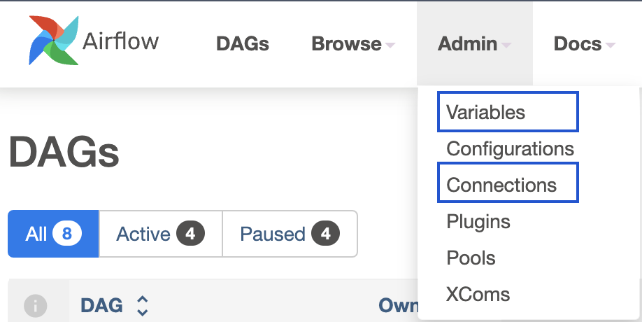
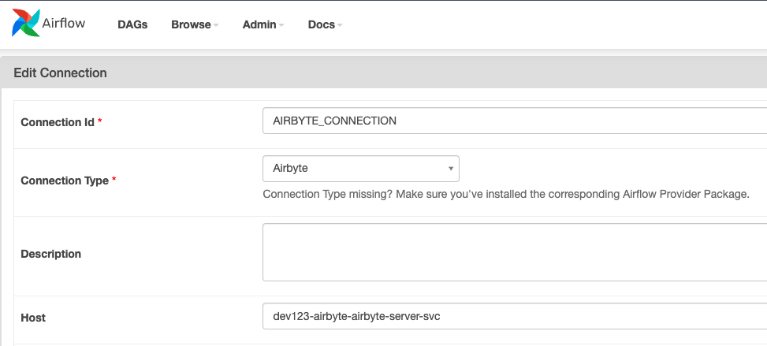

# Variables and Connections

>[!NOTE]dbt-coves generate airflow-dags does not support reading variables/connections, but you may generate the initial Python Airflow DAG and add the connection / variable information.

The best way to store and retrieve information within Airflow is to use `Variables` and `Connections`, both available on the `Admin` upper dropdown.



The main difference between them is that [Variables](https://airflow.apache.org/docs/apache-airflow/2.3.1/howto/variable.html) is a generic multi-purpose store, while [Connections](https://airflow.apache.org/docs/apache-airflow/2.3.1/howto/connection.html) are aimed at third-party providers.

>[!TIP]Rather than using connections or variables stored in Airflow’s database, we recommend using a Secrets Manager. These secrets are encrypted and can be stored either in [Datacoves Secrets manager](/how-tos/airflow/use-datacoves-secrets-manager.md) or a third-party secrets manager like [AWS Secrets Manager](/how-tos/airflow/use-aws-secrets-manager)

## Usage

### Variables

After creating a variable in Airflow's UI, using it is as simple as importing the `Variable` model in your DAG and `getting` it's name. If a variable contains `SECRET` on it's name, value will be hidden:


```python
from pendulum import datetime
from airflow.decorators import dag, task
from airflow.models import Variable

@dag(
    default_args={"start_date": datetime(2024, 1, 1)},
    description="DAG that outputs a Variable",
    schedule="0 0 1 */12 *",
    tags=["version_1"],
    catchup=False,
)
def variables_dag():

    @task.datacoves_bash(="main")
    def transform():
        daily_run_tag = Variable.get("DBT_DAILY_RUN_TAG") 
        return f"dbt build -s 'tag:{daily_run_tag}'"

    transform()

variables_dag()
```

### Connections

Consuming connections data is also straightforward, though you need to take it's attributes into consideration, as they'll vary depending on the provider.

In the following example, a connection of `type Airbyte` is created, and it's `host` is echoed in a DAG.



```python
from pendulum import datetime

from airflow.decorators import dag, task
from airflow.models import Connection

@dag(
    default_args={"start_date": datetime(2024, 1, 1)},
    description="DAG that outputs Airbyte Hostname",
    schedule="0 0 1 */12 *",
    tags=["version_1"],
    catchup=False,
)
def connections_dag():
    
    @task.datacoves_bash()
    def echo_airbyte_host():
        airbyte_connection = Connection.get_connection_from_secrets(conn_id="AIRBYTE_CONNECTION") 
        return f"echo 'Airbyte hostname is {airbyte_connection.host}'"

    echo_airbyte_host()

connections_dag()
```
