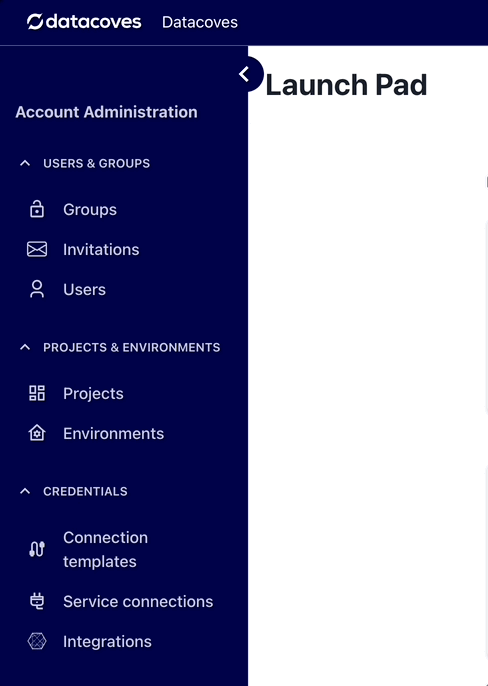
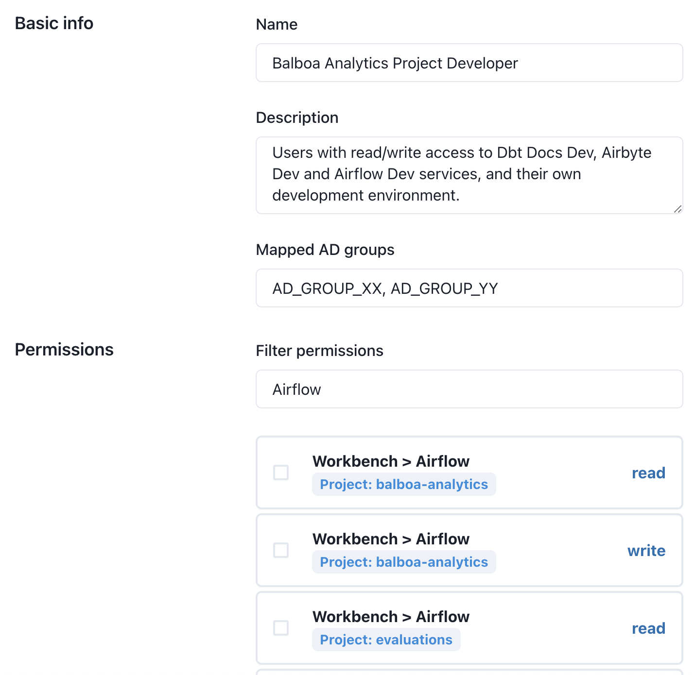

# How to Create/Edit a Group
Navigate to the groups page in the admin menu

Each group consist of three main components:

- `Name`
- `Description` (to help identify what each group permits and restricts)
- A list of `Permissions`, which consist of single `read` and `write` authorizations, to help granulate the user experience as much as possible.

Apart from these main fields, you can optionally map the group to a comma-separated list of `Active Directory groups`, as well as `Filter` the available permissions to enable/disable them with ease.

In terms of specific application permissions, i.e. Airflow and Superset, you can use both general and specific scopes:

- To work permissions at global level (the entire application), you can give `read` or `write` permissions to it's entire scope:

  

  - Giving an application scope `write` access, gives the group the entire set of the application's permissions, and with it also to it's resources.
  - Giving an application scope `read` access, sets the group as viewer (read-only)

- To give permissions to certain resources of an application, you can toggle `write` access on only those of interest, leaving the general scope (for example, `Workbench>Airflow`) unmarked.

  

  Some of the specific component permissions include:

  - `Airflow > Admin`: access to Airflow's Admin menu (connections, variables, etc)
  - `Airflow > Security`: access to Airflow's Security menu (users and roles administration)
  - `Airflow > Dags`: running DAGs and jobs
  - `Superset > Data-Sources`: Superset data sources administration
  - `Superset > Security`: access to Superset's Security menu (users, roles, permissions, etc.)
